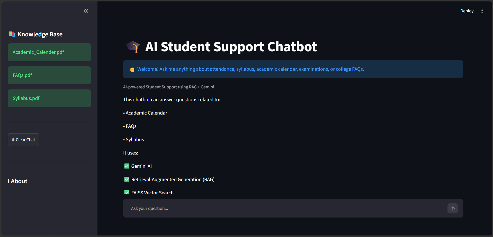
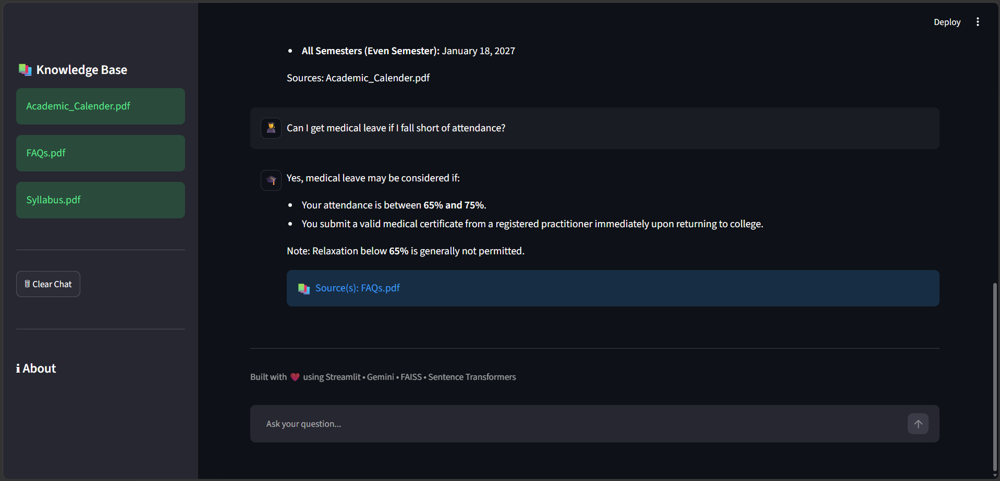

# 🎓 AI Student Support Chatbot using RAG and Gemini

## 📌 Overview

The AI Student Support Chatbot is a Retrieval-Augmented Generation (RAG) application that answers student queries using college documents such as syllabus, attendance policy, academic calendar, and FAQs.

Instead of answering from general knowledge, it retrieves relevant information from uploaded PDF documents and generates accurate responses using Google Gemini.

---

## ✨ Features

- 📄 PDF-based Question Answering
- 🤖 Google Gemini Integration
- 🔍 Semantic Search using FAISS
- 🧠 Sentence Transformer Embeddings
- 💬 Interactive Streamlit Chat Interface
- 📚 Displays Source Documents
- ⚡ Persistent FAISS Vector Database

---

## 🛠 Technologies Used

- Python 3.11
- Streamlit
- Google Gemini API
- Sentence Transformers
- FAISS
- PyPDF
- NumPy

---

## 📂 Project Structure

```text
student-support-chatbot/
│
├── app.py
├── build_index.py
├── requirements.txt
├── .env
│
├── chatbot/
│   ├── loader.py
│   ├── splitter.py
│   ├── embeddings.py
│   ├── vectorstore.py
│   ├── gemini.py
│   └── rag.py
│
├── data/
│
├── vector_db/
│   ├── index.faiss
│   └── metadata.pkl
│
└── README.md
```

---

## 🚀 Installation

Clone the repository

```bash
git clone <repository-url>
```

Create a virtual environment

```bash
python -m venv std_venv
```

Activate the virtual environment

### Windows

```bash
std_venv\Scripts\activate
```

Install dependencies

```bash
pip install -r requirements.txt
```

---

## 🔑 Configure API Key

Create a `.env` file in the project root.

```env
GOOGLE_API_KEY=YOUR_API_KEY
```

---

## 📚 Build the Knowledge Base

Whenever PDFs are added or modified inside the `data` folder, rebuild the FAISS index:

```bash
python build_index.py
```

---

## ▶️ Run the Application

```bash
streamlit run app.py
```

---

## 🧠 How It Works

1. Load PDF documents
2. Split documents into smaller chunks
3. Generate embeddings using Sentence Transformers
4. Store embeddings in a FAISS vector database
5. Convert the user's question into an embedding
6. Retrieve the most relevant document chunks
7. Send the retrieved context to Gemini
8. Display the generated answer along with the document sources

---

## 🚧 Limitations

- Answers are limited to the uploaded documents.
- Requires an internet connection for Gemini API.
- Knowledge base must be rebuilt after updating PDFs.

---

## 🔮 Future Scope

- PDF upload from the web interface
- Conversation memory
- Voice-based interaction
- Multi-language support
- Integration with college ERP systems

---

## Screenshots

### Home Page



### Chat Interface



---

## 👨‍💻 Developed By

**Asrar Hasan**

AI-Based Student Support Chatbot using RAG and Google Gemini


# 🎓 AI Student Support Chatbot using RAG and Gemini

## 📌 Overview

The AI Student Support Chatbot is a Retrieval-Augmented Generation (RAG) application that answers student queries using college documents such as syllabus, attendance policy, academic calendar, and FAQs.

Instead of answering from general knowledge, it retrieves relevant information from uploaded PDF documents and generates accurate responses using Google Gemini.

---

## ✨ Features

- 📄 PDF-based Question Answering
- 🤖 Google Gemini Integration
- 🔍 Semantic Search using FAISS
- 🧠 Sentence Transformer Embeddings
- 💬 Interactive Streamlit Chat Interface
- 📚 Displays Source Documents
- ⚡ Persistent FAISS Vector Database

---

## 🛠 Technologies Used

- Python 3.11
- Streamlit
- Google Gemini API
- Sentence Transformers
- FAISS
- PyPDF
- NumPy

---

## 📂 Project Structure

```text
student-support-chatbot/
│
├── app.py
├── build_index.py
├── requirements.txt
├── .env
│
├── chatbot/
│   ├── loader.py
│   ├── splitter.py
│   ├── embeddings.py
│   ├── vectorstore.py
│   ├── gemini.py
│   └── rag.py
│
├── data/
│
├── vector_db/
│   ├── index.faiss
│   └── metadata.pkl
│
└── README.md
```

---

## 🚀 Installation

Clone the repository

```bash
git clone <repository-url>
```

Create a virtual environment

```bash
python -m venv std_venv
```

Activate the virtual environment

### Windows

```bash
std_venv\Scripts\activate
```

Install dependencies

```bash
pip install -r requirements.txt
```

---

## 🔑 Configure API Key

Create a `.env` file in the project root.

```env
GOOGLE_API_KEY=YOUR_API_KEY
```

---

## 📚 Build the Knowledge Base

Whenever PDFs are added or modified inside the `data` folder, rebuild the FAISS index:

```bash
python build_index.py
```

---

## ▶️ Run the Application

```bash
streamlit run app.py
```

---

## 🧠 How It Works

1. Load PDF documents
2. Split documents into smaller chunks
3. Generate embeddings using Sentence Transformers
4. Store embeddings in a FAISS vector database
5. Convert the user's question into an embedding
6. Retrieve the most relevant document chunks
7. Send the retrieved context to Gemini
8. Display the generated answer along with the document sources

---

## 🚧 Limitations

- Answers are limited to the uploaded documents.
- Requires an internet connection for Gemini API.
- Knowledge base must be rebuilt after updating PDFs.

---

## 🔮 Future Scope

- PDF upload from the web interface
- Conversation memory
- Voice-based interaction
- Multi-language support
- Integration with college ERP systems

---

## Screenshots

### Home Page


### Chat Interface


---

## 👨‍💻 Developed By

**Asrar Hasan**

AI-Based Student Support Chatbot using RAG and Google Gemini
